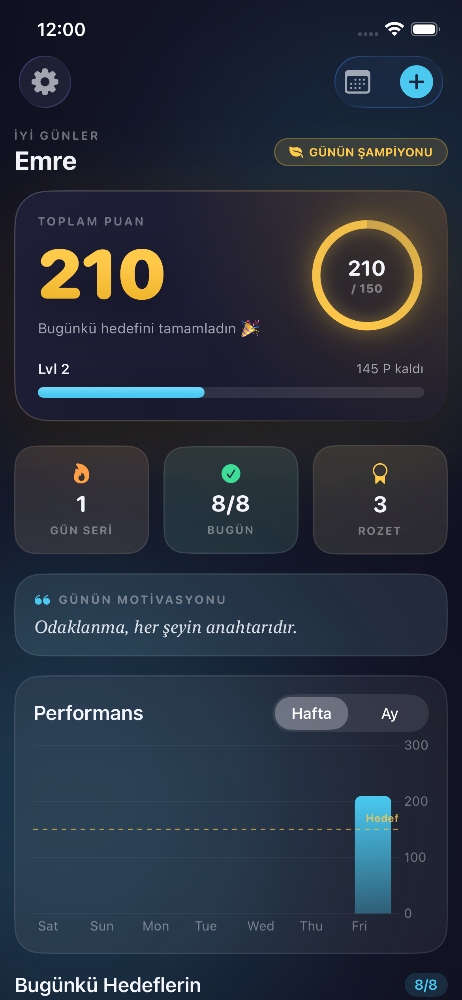
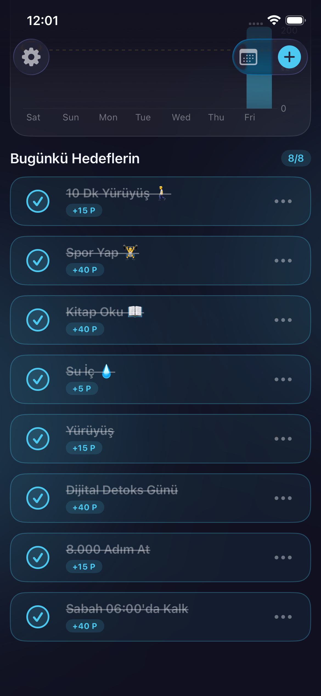
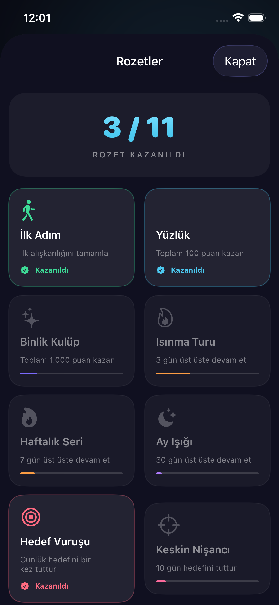
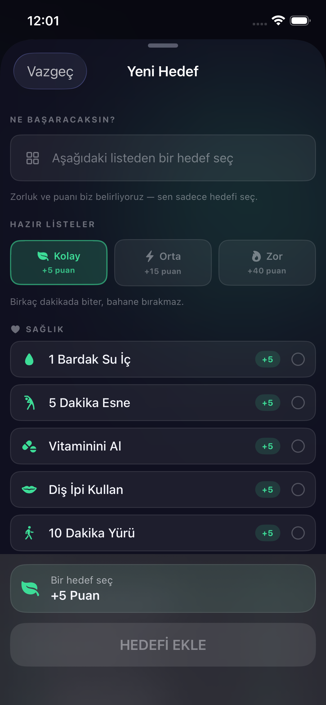
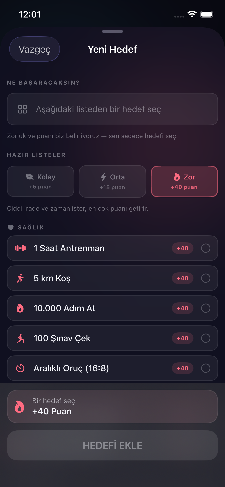
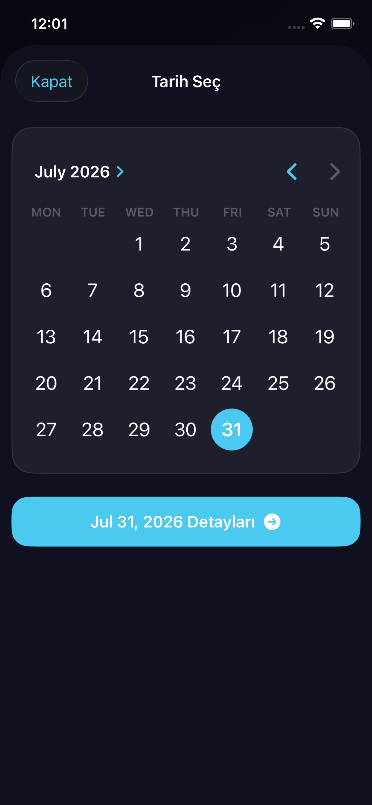
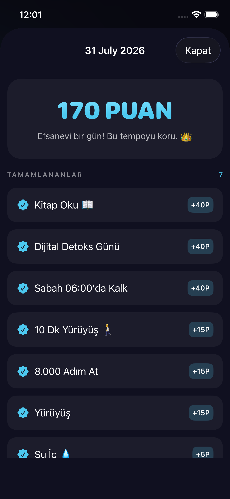
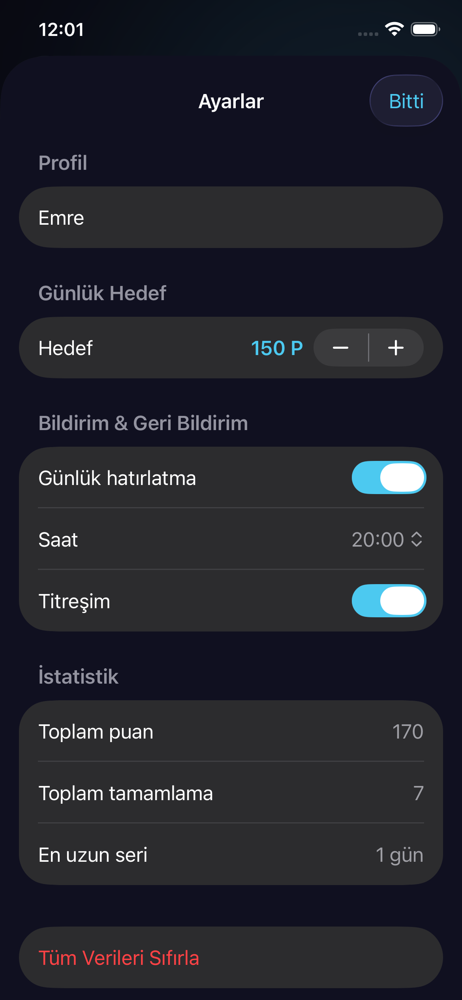

# 🧠 Dopamine — Alışkanlık Takip Uygulaması

<p align="center">
  
</p>

**Dopamine**, günlük alışkanlıklarını takip ederek motivasyonunu yüksek tutan, oyunlaştırma (gamification) mantığıyla çalışan bir iOS uygulamasıdır. Alışkanlık tamamladıkça puan kazan, seviye atla ve kendini ödüllendir!

---

## ✨ Özellikler

- 🎯 **Hazır Alışkanlık Kataloğu** — Kolay / Orta / Zor listelerinden, kategorilere ayrılmış 50+ hazır aktiviteden seç
- ⚖️ **Otomatik Zorluk** — Zorluk ve puan kullanıcıya bırakılmaz; her aktivitenin seviyesi katalogda tanımlıdır
- 🔥 **Seri (Streak) Takibi** — Hem alışkanlık bazlı hem genel kesintisiz gün serisi
- 🏅 **Rozet Sistemi** — 11 farklı başarım, ilerleme çubuklarıyla birlikte
- 📊 **Haftalık / Aylık Grafik** — Charts ile hedef çizgisi gösterimli performans grafiği
- 🏆 **Eğrisel Seviye & Rütbe Sistemi** — 30 seviye, 12 rütbe, dinamik tema rengi
- 🎯 **Günlük Hedef** — Kendi hedefini belirle, halkayı doldur
- 📅 **Kalıcı Geçmiş** — Her tamamlama ayrı kayıt olarak saklanır; geçmiş puanların asla kaybolmaz
- 💬 **Motivasyon Sözleri** — Her gün farklı bir ilham verici söz
- 🔔 **Akıllı Bildirimler** — Saat seçimli günlük hatırlatma + "serin tehlikede" uyarısı
- ⚙️ **Ayarlar Ekranı** — İsim, hedef, bildirim saati, titreşim ve veri sıfırlama
- 📳 **Haptic Feedback** — Ayarlardan kapatılabilir dokunsal geri bildirim
- ♿️ **Erişilebilirlik** — VoiceOver etiketleri ve "Hareketi Azalt" desteği
- 🧹 **Otomatik Günlük Sıfırlama** — Gün değişince liste kendiliğinden temizlenir

---

## 📸 Ekran Görüntüleri

| Ana Ekran | Günün Hedefleri | Rozetler |
|:--:|:--:|:--:|
|  |  |  |

| Hedef Ekle — Kolay | Hedef Ekle — Zor | Takvim |
|:--:|:--:|:--:|
|  |  |  |

| Günlük Detay | Ayarlar |
|:--:|:--:|
|  |  |

---

## 🎬 Demo Video

> 📹 [Demo videosunu izlemek için tıklayın](Screenshots/demo.mov)

---

## 🏗️ Mimari & Teknolojiler

| Katman | Teknoloji |
|---|---|
| **UI** | SwiftUI |
| **Veri** | SwiftData |
| **Grafik** | Swift Charts |
| **Mimari** | MVVM (Model-View-ViewModel) |
| **Minimum iOS** | iOS 17+ |

### 📁 Proje Yapısı

```
Dopamine/
├── Models/
│   ├── Habit.swift              # Alışkanlık veri modeli
│   ├── HabitLog.swift           # Tamamlanma kaydı (kalıcı geçmiş)
│   ├── Achievement.swift        # Rozet modeli & motoru
│   ├── DailyProgress.swift      # Günlük ilerleme modeli
│   └── LevelSystem.swift        # Seviye & rütbe sistemi
├── ViewModels/
│   ├── DashboardViewModel.swift # Ana ekran iş mantığı
│   ├── AddHabitViewModel.swift  # Alışkanlık ekleme mantığı
│   ├── DailyDetailViewModel.swift
│   ├── HabitRowViewModel.swift
│   └── OnboardingViewModel.swift
├── Views/
│   ├── DashboardView.swift      # Ana ekran
│   ├── AddHabitView.swift       # Alışkanlık ekleme
│   ├── DailyDetailView.swift    # Günlük detay
│   ├── AchievementsView.swift   # Rozet vitrini
│   ├── SettingsView.swift       # Ayarlar
│   ├── HabitRow.swift           # Alışkanlık satırı
│   └── OnboardingView.swift     # Karşılama ekranı
└── Helpers/
    ├── HabitCatalog.swift       # Hazır aktivite kataloğu, zorluk & kategori
    ├── Theme.swift              # Tasarım sistemi (renk, boşluk, tipografi)
    ├── HapticManager.swift      # Dokunsal geri bildirim
    ├── NotificationManager.swift # Bildirim yönetimi
    ├── DataMigrator.swift       # v1 → v2 veri taşıma
    ├── QuoteProvider.swift      # Motivasyon sözleri
    └── SharedComponents.swift   # Ortak UI bileşenleri
```

---

## 🗂️ Alışkanlık Kataloğu

Kullanıcı serbest metin yazmaz; hedefini **hazır listeden seçer**. Böylece
zorluk ve puanlama her kullanıcıda tutarlı kalır.

| Seviye | Puan | Örnek Aktiviteler |
|---|---|---|
| 🟢 **Kolay** | +5 | Yatağını topla, 1 bardak su iç, 5 dakika esne, vitaminini al, bitkileri sula, sevdiğine mesaj at |
| 🟡 **Orta** | +15 | 20 sayfa kitap oku, 10 dakika meditasyon, 8.000 adım at, ev yemeği pişir, aileni ara, soğuk duş al |
| 🔴 **Zor** | +40 | 1 saat antrenman, 5 km koş, 100 şınav çek, sabah 06:00'da kalk, dijital detoks, 2 saat derin çalışma |

Aktiviteler 6 kategoriye ayrılır: **Sağlık · Zihin · Üretkenlik · Yaşam · Bağlantı · Disiplin**.

---

## 🎮 Puan & Seviye Sistemi

| Zorluk | Puan |
|---|---|
| 🟢 Kolay | +5 |
| 🟡 Orta | +15 |
| 🔴 Zor | +40 |

> Zorluk seviyesi katalogda önceden tanımlıdır; kullanıcı değiştiremez.

Seviye eşiği eğriseldir: bir seviyeyi tamamlamak için `100 × seviye^1.35` puan gerekir.
Toplam **30 seviye** ve **12 rütbe** bulunur.

| Seviye | Rütbe | Kümülatif Puan |
|---|---|---|
| 1 | Çaylak | 0 |
| 2 | Isınıyor | 100 |
| 3 | Gelişmekte Olan | 355 |
| 4 | İstikrarlı | 800 |
| 5 | Odak Ustası | 1.435 |
| 6–7 | Disiplin Savaşçısı | 2.290+ |
| 8–9 | Dopamin Mimarı | 4.665+ |
| 10–12 | Zihin Simyacısı | 7.925+ |
| 13–16 | Alışkanlık Lordu | 12.100+ |
| 17–21 | Efsane | 20.100+ |
| 22–29 | Mitolojik | 33.000+ |
| 30 | Ölümsüz | — |

---

## 🚀 Kurulum

1. Bu repoyu klonlayın:
   ```bash
   git clone https://github.com/burakpla/Dopamine.git
   ```
2. Xcode 16+ ile `Dopamine.xcodeproj` dosyasını açın
3. iPhone 17 Pro veya üzeri simülatör seçin
4. ▶️ **Run** yapın

---

## 📄 Lisans

Bu proje MIT lisansı altında sunulmaktadır.

---

<p align="center">
  <b>Dopamine</b> ile her gün bir adım daha ileri! 🚀
</p>
